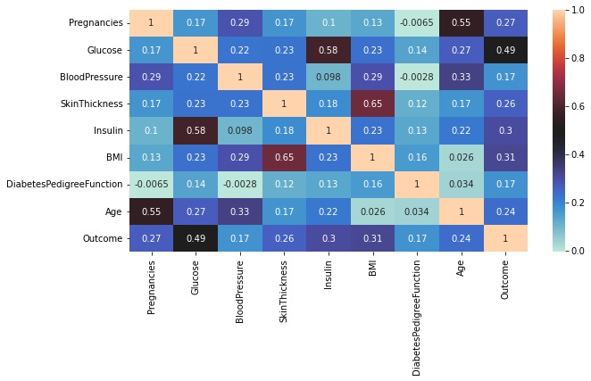
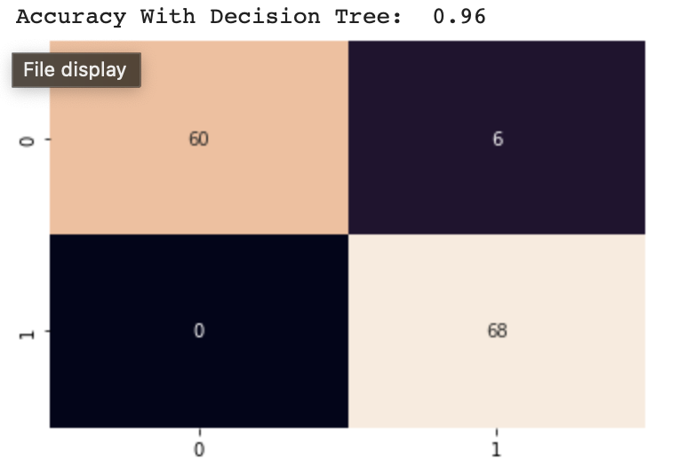

# Diabetes Classification

## Project Overview

This project is focused on the classification of diabetes using a machine learning approach. The primary goal is to build a predictive model that can distinguish between individuals with diabetes and those without it based on health-related features.

## Dataset

- The dataset used in this project is named "diabetes.csv" and contains several health-related features, including Glucose, BMI, and Age, along with the target variable "Outcome" (1 indicates diabetes, 0 indicates no diabetes).

## Data Preprocessing

- Checked for and handled null values by converting zeros to NaN.
- Dropped the "Insulin" column due to more than 30% null values.
- Imputed missing values with the median for specific features.
- checked and fixed skewness
- Made the data balanced

## Models

### Logistic Regression
- Achieved a training accuracy of 80% and a testing accuracy of 78%.
- The confusion matrix shows the model's performance with precision and recall.

### Decision Tree Classifier
- Achieved a testing accuracy of 92.54%.
- Visualized the decision tree structure.

### Random Forest Classifier
- Achieved a testing accuracy of 96.27%.
- Visualized the confusion matrix.

## Prerequisites

- Python (3.6+)
- Required libraries and dependencies (listed in requirements.txt)

## Project Structure

The project is organized as follows:

- `diabetes.csv`: The dataset used for training and testing.
- `final-Lab-Project.ipynb`: A Jupyter Notebook containing the Python code for data preprocessing, modeling, and evaluation.
- `README.md`: This file.

## Usage

- To run this project on your local machine, follow the steps outlined in the `diabetes_prediction.ipynb` notebook.
- Customize the project settings, model architectures, and data paths as needed.

## Conclusion

The Random Forest model achieved the highest testing accuracy at 96.27%, outperforming the other models. The Decision Tree model also performed well with an accuracy of 92.54%. The Logistic Regression model had the lowest accuracy at 78%.

## Acknowledgments

- The dataset used in this project is sourced from a publicly available dataset and can be found at [kaggle](https://www.kaggle.com/datasets/uciml/pima-indians-diabetes-database)

## Contact

- MD Fahim Afridi Ani
- fahimafridi043@gmail.com
- www.linkedin.com/in/fahim043

Feel free to contribute, provide feedback, or use this project as a starting point for your own machine learning projects. Happy coding!
